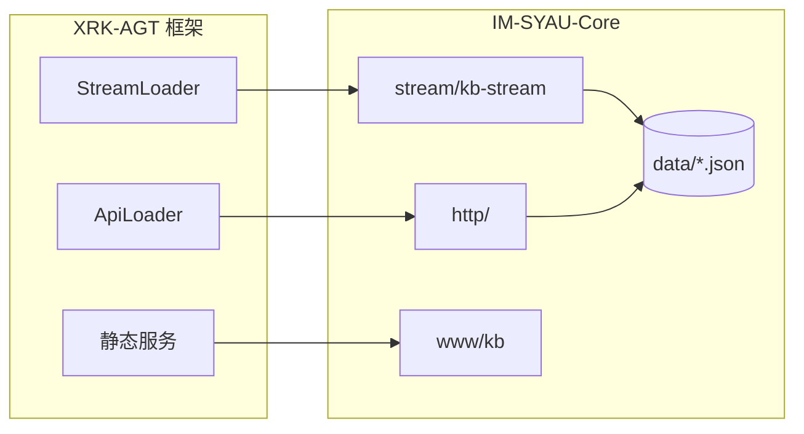
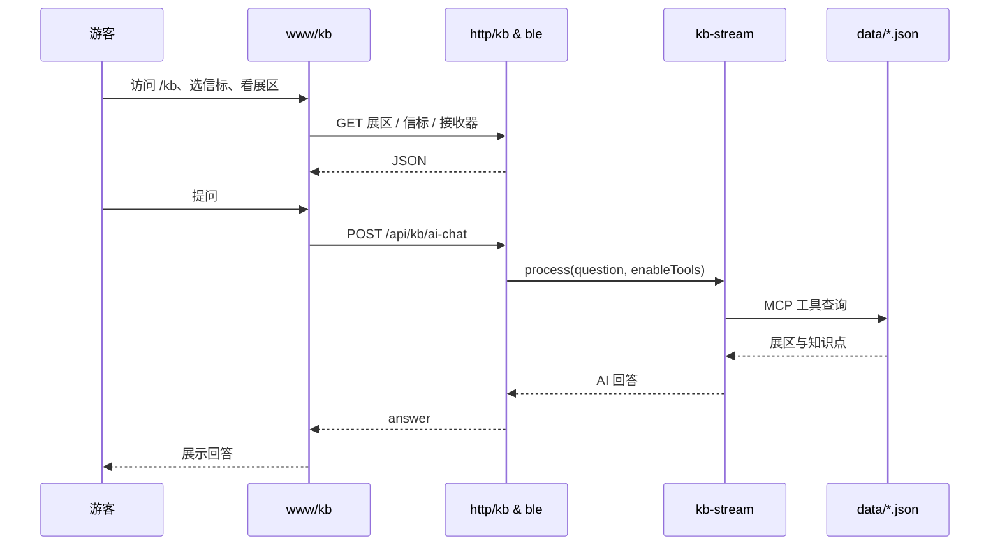

<p align="center">
  
</p>

<h1 align="center">IM-SYAU-Core 沈阳农业大学昆虫博物馆</h1>

<p align="center">
  基于 <strong>XRK-AGT</strong> 的智能导览 Core：蓝牙信标定位、展区信息、AI 问答（aistream + 知识库 MCP 工具）
</p>

---

## 关于 XRK-AGT

**XRK-AGT** 是多平台、多 Tasker、工作流驱动的智能体框架。通过 `core/` 目录下的各 Core 提供 HTTP API、Stream 工作流、静态站点等能力；框架自动扫描并加载各 Core 的 `http/`、`stream/`、`www/` 等，无需手写注册。本 Core（IM-SYAU-Core）即其中一个业务 Core，专为沈阳农业大学昆虫博物馆提供导览与问答能力。

---

## 本 Core 在 AGT 中的位置



## 游客与数据流



---

## 目录结构

```
IM-SYAU-Core/
├── README.md
├── 沈阳农业大学-logo-2048px.png   # 校徽
├── data/
│   ├── exhibitions.json
│   └── knowledge.json
├── http/
│   ├── ble.js
│   └── kb.js
├── stream/
│   └── kb-stream.js
├── utils/
│   └── ble-utils.js
└── www/kb/
    ├── index.html, js/, css/
    └── data/   # 前端展区、提示词、参观统计
```

---

## 与 AGT 接轨

| 目录    | 框架加载方式     | 说明 |
|---------|------------------|------|
| `http/` | ApiLoader 扫描   | 注册 `/api/ble/*`、`/api/kb/*` |
| `stream/` | StreamLoader 扫描 | 注册 `kb-stream`，MCP 工具读 `data/` |
| `www/kb/` | 静态挂载到 `/kb` | 访问 `/kb/index.html` |

前端 `www/kb/js/app.js` 通过 `API` 常量与 `apiGet` / `apiPost` 对接上述路由，统一处理 `success`、`data`、`message`。

---

## API 一览

| 方法 | 路径 | 说明 |
|------|------|------|
| GET  | `/api/kb/exhibitions` | 展区信息 |
| GET  | `/api/kb/prompts` | AI 预设问题 |
| POST | `/api/kb/ai-chat` | AI 问答（走 kb-stream + MCP 工具） |
| GET  | `/api/kb/beacon/:beaconId/receivers` | 指定信标接收器 |
| GET  | `/api/kb/visitor-stats` | 参观人数统计 |
| GET  | `/api/ble/data` | 完整蓝牙数据 |
| GET  | `/api/ble/esp-c3-beacons` | ESP-C3 信标列表 |
| GET  | `/api/ble/beacon/:beaconMac/receivers` | 单信标接收器 |
| GET  | `/api/ble/status` | 状态统计 |

---

## 配置与数据

- **AI 问答**：由框架 aistream/LLM 统一配置，本 Core 仅提供 `kb-stream` 与 `data/`；无需在此配置 API Key。
- **知识库**：`data/exhibitions.json`（展区）、`data/knowledge.json`（关键词+答案）供 MCP 工具使用。
- **蓝牙**：`data/blues/ble_data.json`（项目根下 `data/`）由外部采集写入；路径通过 AGT `paths.data` 解析。
- **参观统计**：`www/kb/data/visitor-stats.json` 可选，格式 `[{ "date": "YYYY-MM-DD", "count": n }]`。

---

<p align="center"><strong>最后更新</strong>：2026 年</p>
